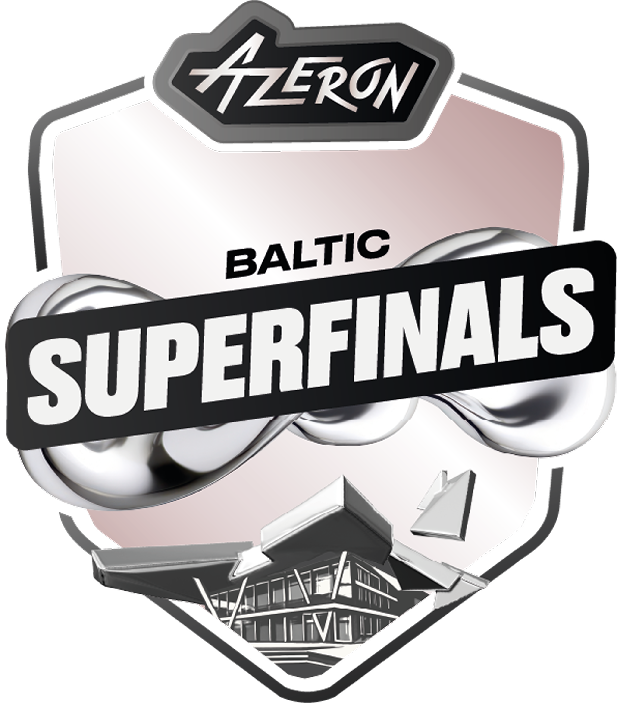

  

# "Azeron" Baltic Superfinal – General Information and rules

#### Dear reader,

Welcome to the **"Azeron" Baltic Superfinal**!  
We’re excited to have you on board. To ensure a smooth and enjoyable experience for everyone, we ask you to follow these essential rules. Adhering to these guidelines helps avoid any penalties and keeps the competition fair and fun for all.

Remember, the tournament administration has the final say on all matters. Sometimes, decisions may be made beyond what’s stated in this rulebook to uphold the spirit of fair play and good sportsmanship.

“"Azeron" Baltic Superfinal” tournament is organized by Kleverr E-sporta Biedrība (40008329844).

“"Azeron" Baltic Superfinal”  is a Tier 2 Valve Regional Standings (VRS) Ranked Counter-Strike 2 tournament with an open LAN format.

As a VRS-ranked event, "Azeron" Baltic Superfinal adheres to Valve’s rules for ranked tournaments, ensuring a fair structure for invites and qualifiers. The Valve Regional Standings (VRS) is the official ranking system used by Valve to gauge team performance and determine invitations for CS2 events. This rulebook outlines all regulations, format details, and expectations for teams participating in Urban Riga Open.
Finally, our goal is to create an engaging and exciting event for participants, spectators, and partners.

Best regards,

Kleverr staff.

---

## Table of Contents

- [SECTION ONE - General information](#section-one--general-information)
  - [1.1 Event Name](#11-event-name)
  - [1.2 Tier](#12-tier)
  - [1.3 Dates](#13-dates)
  - [1.4 Location](#14-location)
  - [1.5 Team Cap](#15-team-cap)
  - [1.6 Registration](#16-registration)
  - [1.7 Entry Fee](#17-entry-fee)
  - [1.8 Team Eligibility](#18-team-eligibility)
  - [1.9 Sign-up Process](#19-sign-up-process)
  - [1.10 Refund Policy](#110-refund-policy)
  - [1.11 VRS Seeding](#111-vrs-seeding)
  - [1.12 Prize Pool](#112-prize-pool)
    - [1.12.1 Prize Payout](#1121-prize-payout)
  - [1.13 Match Times](#113-match-times)
    - [1.13.1 LAN Qualifiers](#1131-lan-qualifiers)
    - [1.13.2 Play offs](#1132-play-offs)
- [SECTION TWO - Game rules](#section-two--game-rules)
  - [2.1 Group Stage](#21-group-stage)
    - [2.1.1 Group Stage Seeding](#211-group-stage-seeding)
    - [2.1.2 Group Stage Point System](#212-group-stage-point-system)
    - [2.1.3 Tiebreakers](#213-tiebreakers)
  - [2.2 Playoffs](#22-playoffs)
    - [2.2.1 Playoff Bracket](#221-playoff-bracket)
  - [2.3 Playoff Seeding](#23-playoff-seeding)
- [APPENDIX I - Full Rulebook](#appendix-i--full-rulebook)
- [APPENDIX II - Tournament schedule](#appendix-ii--tournament-schedule)
- [APPENDIX III - Registration Timestamps](#appendix-iii--registration-timestamps)

---

## SECTION ONE – General Information

### 1.1 Event Name
"Azeron" Baltic Superfinal

### 1.2 Tier
Tier 2 VRS-ranked event.

### 1.3 Dates
###### LAN Qualifier
**July 12th** (Sunday)
###### Play Offs
**July 25th - July 26th, 2026** (two days: Saturday & Sunday)

### 1.4 Location
#### LAN Qualifier
**["Cyber Empire" E-sports lounge, Riga, Latvia](https://www.google.com/maps/place//data=!4m2!3m1!1s0x46eecf279a3d42d3:0xbfc9d656c1ab832a?sa=X&ved=1t:8290&ictx=111)**
#### Play Offs
**[Concert Hall "Latvija", Ventspils, Latvia](https://www.google.com/maps?vet=10CAAQoqAOahcKEwjI45iot8aVAxUAAAAAHQAAAAAQCw..i&pvq=Cg0vZy8xMWg3NzZ2bDI3IhIKDENvbmNlcnQgSGFsbBACGAM&lqi=ChZDb25jZXJ0IEhhbGwgIkxhdHZpamEiSMeQtfOcr4CACFogEAAQARgCIhRjb25jZXJ0IGhhbGwgbGF0dmlqYTICbHaSAQxjb25jZXJ0X2hhbGw&fvr=1&cs=1&um=1&ie=UTF-8&fb=1&gl=lv&sa=X&ftid=0x46f1c9690bdb44c3:0xcb7b76e8e6725ad)**

### 1.5 Team Cap
- 16 teams
- Teams consist of 5 players + (optionally) 1 coach  
- All participants must be able attend on-site

### 1.6 Registration
Teams must register via [Google Form](https://docs.google.com/forms/d/e/1FAIpQLSe7ayfjByyhjrHhesBYiTavii4viRgfqY4BaCMIlDBr4_jCzg/viewform), then wait for an invoice from Kleverr staff, then pay the registration fee per team (covers 5 players + 1 coach). It will be sent as an invoice and is required to be paid in 48 hours to confirm entry (2 business days). Registration is first-come, first-served.

### 1.7 Entry Fee
To participate in the tournament, a team must complete the registration form available in [Kleverr stories](https://x.com/kleverrstories) socials and pay the required entry-fee of 150 EUR for "Azeron" Baltic LAN Qualifier.

### 1.8 Team Eligibility
Open to all teams in the Baltic region, as defined by Valve’s official rules and regulations. No prior qualification or minimum rank is required; however, all players must have valid CS2 accounts in good standing (no VAC bans in the last 2 years).

### 1.9 Sign-up Process
Teams register via Google Form. Once thats filled, organizer will contact the team with and request teams requisite and send an invoice. Once thats paid, team fee secures the spot.

### 1.10 Refund policy
The participation fee is non-refundable, except in the case that the tournament is cancelled due to insufficient teams (fewer than 4 registered and paid teams).

If the event is cancelled under these circumstances, all paid participation fees will be fully refunded to the respective teams.

No refunds will be issued for withdrawals, no-shows, or inability to participate for reasons not caused by the tournament operator.

### 1.11 VRS Seeding
In line with Valve’s guidelines for Tier 2 Open events, "Azeron" Baltic Superfinal will use VRS Global rankings to seed teams into Groups.
Seeding will be based on the official Global VRS ranking released on Monday, Jul 6th 2026.

### 1.12 Prize Pool
- 1st: $2,500
- 2nd: $500

###### <ins>Total prize pool: $3,000</ins>

#### 1.12.1 Prize Payout
Prizes will be paid within 90 days from the end of the tournament to the bank account designated by the team.
If the team fails to provide the required information within 1 year of the tournament ending the prize money is forfeited.

---

### 1.13 Match Times
Matches are rolling schedule.
#### 1.13.1 LAN Qualifiers
GROUP A and GROUP D |
|:-----:|
12:00 EEST |

GROUP B and GROUP C |
|:-----:|
16:00 EEST |

#### 1.13.2 Play offs
20:00 EEST |
|:-----:|

---

## SECTION TWO – Game Rules
### 2.1 Group Stage
- 4 Groups of Round Robin (BO1)

#### 2.1.1 Group Stage Seeding
Groups are determined using the ["snake seeding"](https://liquipedia.net/tft/Snake_Seeding_System) system:
Group A | Group B | Group C | Group D |
|:-----:|:-------:|:-------:|:-------:|
Seed #1 |Seed #2  |Seed #3  |Seed #4  |
Seed #8 |Seed #7  |Seed #6  |Seed #5  |
Seed #9 |Seed #10 |Seed #11 |Seed #12 |
Seed #16|Seed #15 |Seed #14 |Seed #13 |

#### 2.1.2 Group Stage Point System
Teams will be awarded points by their performance in match:
Result | Points Given
|:-----:|:-------:|
Regulation Win  |3 point |
Win in Overtime |2 point |
Loss in Overtime|1 point |
Regulation Loss |0 point |

#### 2.1.3 Tiebreakers
1. Head-to-head result
2. Round Difference
3. Fewer total round losses
4. Higher initial Group Stage Seed

### 2.2 Playoffs
Single elimination, BO3

#### 2.2.1 Playoff Bracket
#### Quaterfinals
- A1 plays against D2
- B1 plays against C2
- C1 plays against B2
- D1 plays against A2

#### SemiFinals and Finals
Played in Concert Hall "Latvija". Schedule to be determined.

### 2.3 Playoff Seeding
The playoff seeding example applies to an 8-team playoff, which is made possible by two groups. Place in bracket is assigned by the results of the group stage.

Any changes resulting from a different number of group stage teams will be communicated by the organizer before the tournament begins.

---

## APPENDIX I – Full Rulebook
Read the full rulebook here - [LINK](./Rulebook.md)

## APPENDIX II – Tournament Schedule

See in detail here - [TBD]()

## APPENDIX III – Registration Timestamps
See in detail here - [LINK](https://docs.google.com/spreadsheets/d/1jDhhNV3AHj-I8nXYlutNkqQpY-wjs8sHgiYSclGKUh4/edit?gid=1108502583#gid=1108502583)